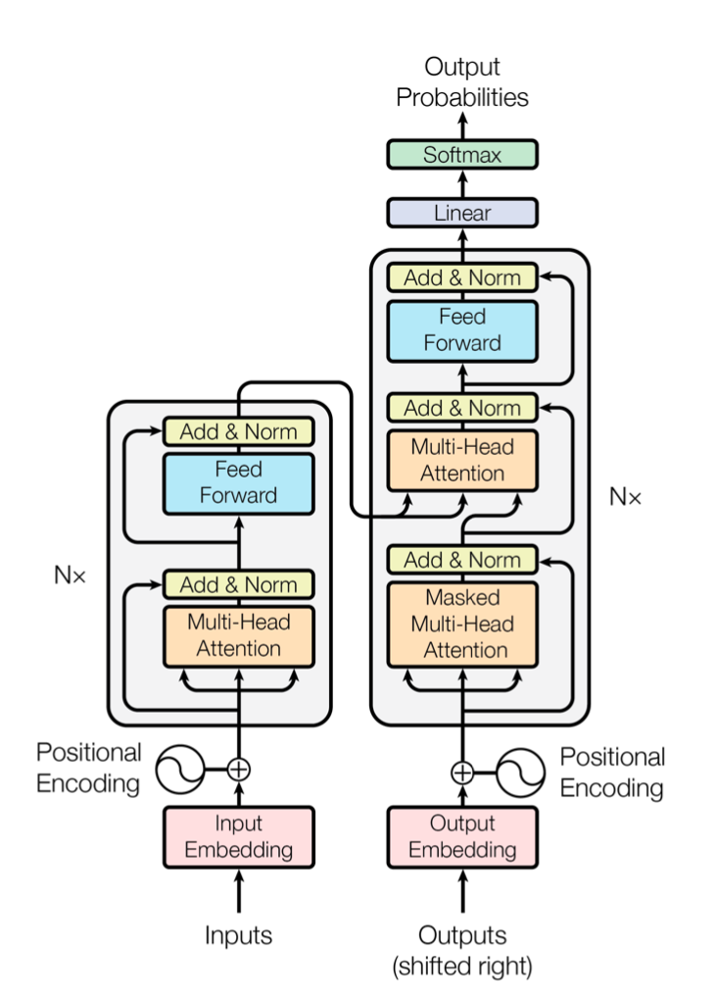
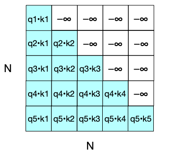

# Programming Assignment 7: Transformers for Machine Translation


## Overview
This programming assignment aims to deepen your understandings of the Transformer architecture. Firstly, you are required to implement some important functions of Transformer. Then, you will apply the implemented Transformer to the task of English-to-German machine translation on the [Multi30K dataset](https://aclanthology.org/W16-3210.pdf), a multilingual dataset with 31,014 German translations of English descriptions and 155,070 independently collected German descriptions, and analyze the impact of different hyperparameters and architecture choices on model performances.


## Transformer Architecture
Transformer is a self-attention based model with an encoder-decoder architecture. The architecture of Transformer is shown below. Transformer is made up of the following key components: positional encoding, multi-head attention, addition & normalization, and position-wise feed-forward layer.




## Environment Setup
To use transformers for machine translation, you need to install necessary packages for tokenization and creating vocabulary. Install the required packages by running the following commands in the terminal:
```python
pip install spacy 
python -m spacy download en_core_web_md   # Spacy's trained English model
python -m spacy download de_core_news_md  # Spacy's trained German model
pip install torchtext>=0.10.0   # please visit https://pypi.org/project/torchtext/ and follow the table to install the correct torchtext version based on your device's Pytorch version and Python version. Please install a torchtext version >= 0.10.0, since a lower version of torchtext will raise an error when loading Multi30K in MachineTranslation.py
``` 

## Problem Descriptions
### 1. Programming Problems
First, you need to implement the following important functions of Transformer  in [Transformer.py](./Transformer.py):
- **Question 1(3 points): Implement `scaled_dot_product_attention()` function in class `Attention`**: calculate the scaled dot-product attention of $Q$, $K$ and $V$ using the following formula:
   $$ \text{Scaled Dot-Product Attention}(Q, K, V, \text{mask}) = \text{softmax}(\frac{QK^{T}}{\sqrt{d_{k}}})V $$
  Since we need to prevent leftward information flow in the decoder to preserve the auto-regressive property, we need to mask out the upper-triangle portion of $QK^{T}$ (setting to $-\infty$ ) **when the mask flag is True**.



- **Question 2(1 points): Implement `forward()` function in class `MultiHeadAttention`**: calculate the multi-head attention using the following formula:
   $$ \text{Multi-Head Attention}(\text{query}, \text{key}, \text{value}, \text{mask}) = \text{Concat}(\text{head}_{1}, \text{head}_{2}, \dots, \text{head}_{h})W^{O} $$
   $$ \text{where} \,\,\, \text{head}_{i} = \text{Scaled Dot-Product Attention}(\text{query}W^Q, \text{key}W^K, \text{value}W^V, \text{mask}) $$

   where $h$ is the number of attention heads, $W^O, W^Q, W^K, W^V$ are projection matrices.

- **Question 3(3 points): Implement positional encoding in class `PositionalEncoding`**: implement positional encoding using sine and cosine functions of different frequencies as follows:
   $$ \text{PositionalEncoding}(\text{pos}, 2i) = \sin(\text{pos} / 10000^{2i / d_{\text{model}}}) $$
   $$ \text{PositionalEncoding}(\text{pos}, 2i+1) = \cos(\text{pos} / 10000^{2i / d_{\text{model}}}) $$

   where pos is the position and $i$ is the dimension.

- **Question 4(1 points): Implement `forward()` function in class `AddAndNorm`**: implement addition & normalization using the following formula:
  $$ \text{output} = \text{LayerNorm}(x + \text{Dropout}(\text{Sublayer}(x))) $$


### 2. Analytical Problems
After you have implemented Transformer, in [MachineTranslation.py](./MachineTranslation.py), you will apply the implemented Transformer to the task of English-to-German machine translation on the [Multi30K dataset](https://aclanthology.org/W16-3210.pdf). Model performances are measured by BLEU score, BLEU is a widely-used metric for machine translation, which measures the similarity of the machine-translated text to a set of high quality reference translations. On the Multi30K dataset, the current state-of-the-art model is [ERNIE-UniX2](https://paperswithcode.com/sota/multimodal-machine-translation-on-multi30k), which achieves a BLEU score of 49.3.

- **Question 5(1 points)**: run `MachineTranslation.py` with different hyperparameter settings and analyze the effects of hyperparameters (number of attention heads, number of encoder layers and number of decoder layers, model dimension, hidden dimension in the position-wise feedforward layer) on model performances. 
- **Question 6(1 points)**: In `Transformer.py`, change the `Scaled Dot-Product Attention` into `Dot-Product Attention`, and analyze how model performances have changed. The [original Transformer paper](https://proceedings.neurips.cc/paper_files/paper/2017/file/3f5ee243547dee91fbd053c1c4a845aa-Paper.pdf) claimed that "We suspect that for large values of $d_{k}$, the dot products grow large in magnitude, pushing the softmax function into regions where it has extremely small gradients. To counteract this effect, we scale the dot products by $\frac{1}{\sqrt{d_{k}}}.$" Based on experimental results, do you agree or disagree with this claim?
- **Bonus Question(2 points)**: choose **one** from the following two options:
- - **Option 1**: One possible drawback of absolute positional encoding used by Transformer is it does not directly capture relative positions to each word. To establish more flexible position embeddings, [Relative Position Representation](https://arxiv.org/pdf/1803.02155.pdf) has been proposed by Peter Shaw, Jakob Uszkoreit and Ashish Vaswani, which demonnstrates to bring significant improvements in translation quality. Please analyze how relative position representation works, and implement the relative position representation on the task of English-to-German translation and compare it with absolute positional encoding.
- - **Option 2**: As illustrated in the [original Transformer paper](https://proceedings.neurips.cc/paper_files/paper/2017/file/3f5ee243547dee91fbd053c1c4a845aa-Paper.pdf), the total number of operations of self-attention grows as $O(n^{2}d)$, where $n$ is the sequence length, $d$ is the representation dimension, which can be extremely computationally expensive when working on long documents with $n > 50000$. To improve on the quadratic self-attention cost, numerous approaches have been proposed. For instance, Wang et al. proposed [Linformer](https://arxiv.org/pdf/2006.04768.pdf), a self-attention network with Linear Complexity. Please analyze how Linformer achieves a linear complexity, and implement Linformer on the task of English-to-German translation and compare it with the original Transformer. 


## Policies
Here are some key policies that you need to obey:
- Please solve the problems individually. 
- For programming questions 1 - 4, you are free to use or modify other classes and functions defined inside the `Transformer.py` file, you can also define your own algorithms. Despite you are free to import other packages, the necessary packages you need for implementations are torch, torch.nn and torch.nn.functional, which have already been imported.
- For analytical questions and bonus questions, you can organize your answers in a md/docx/pdf file, code can also be submitted if necessary.